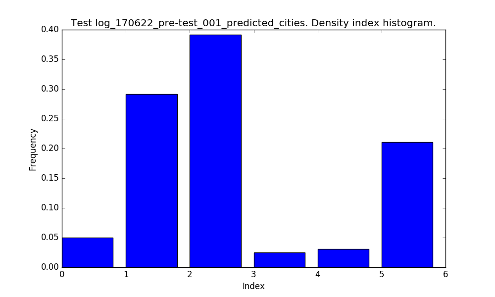
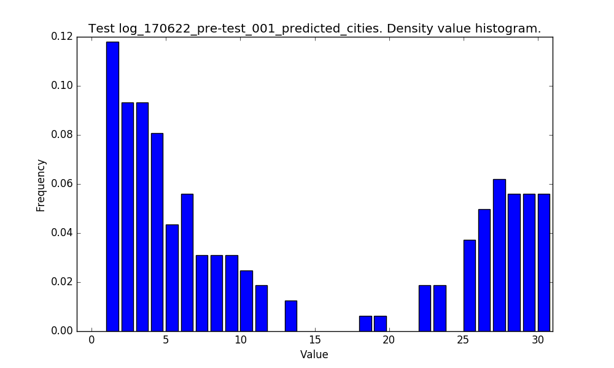
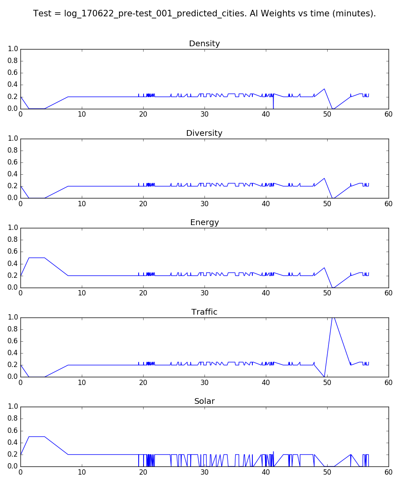
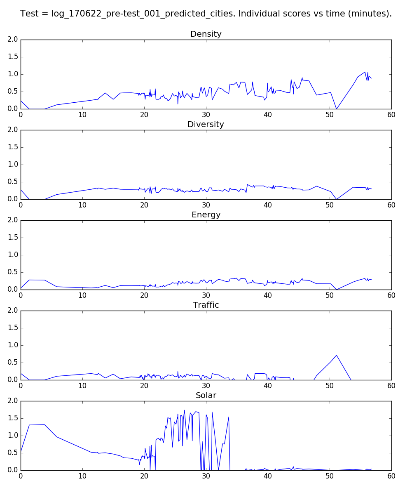
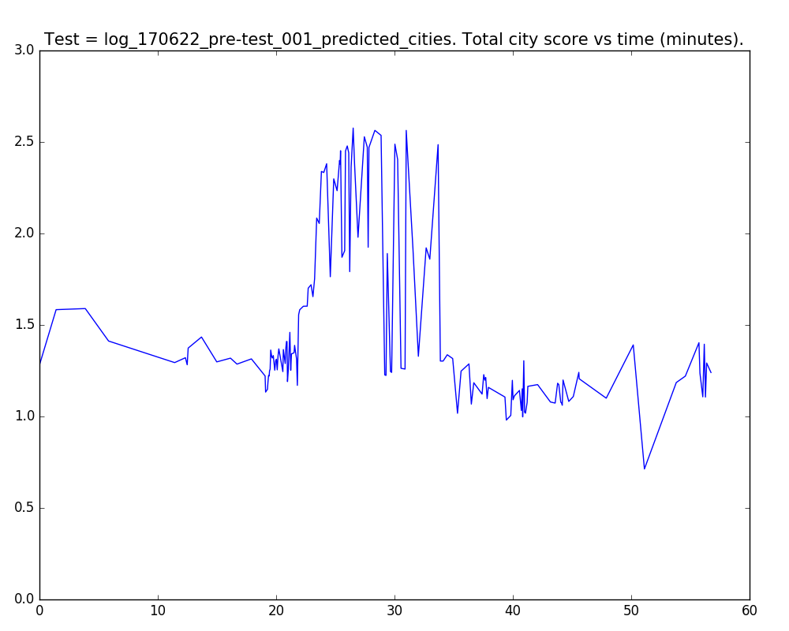
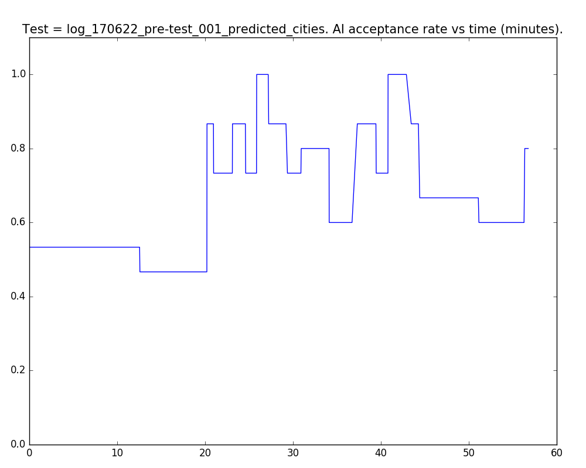

# CityMatrixSim Data Analysis - User Test 001

Here, we seek to analyze some key data metrics from our CityMAItrix Assistant. Use the quick links below to get from section to section.

#### Quick Links

1. [AI Move Type Choice](#ai-move-type-choice)
2. [Density Move Index](#density-move-index)
3. [Density Move Values](#density-move-values)
4. [AI Weights](#ai-weights)
5. [Individual City Scores](#individual-city-scores)
6. [Total City Scores](#total-city-scores)
7. [AI Acceptance Rate](#ai-acceptance-rate)

## AI Move Type Choice

Here are the exact move type counts and corresponding percentages. [(back to top)](#quick-links)

- Total Cities = 305
- CELL = 144 = 47.2 %
- DENSITY = 161 = 52.8 %

## Density Move Index

For **DENSITY** changes, this is the distribution of the density array index where it acts. [(back to top)](#quick-links)

## Density Move Values

And here are the values that the AI tends to suggest. [(back to top)](#quick-links)

## AI Weights

We can take a look at the user's AI weighting values over time. [(back to top)](#quick-links)

## Individual City Scores

Now, we can take a look at each score value over time. Here, I average over every *N = 2* data points to smooth out our score data. [(back to top)](#quick-links)

## Total City Scores

Now, let's take a look at the **total score value for the city** over time. Again, I average over every *N = 2* data points to smooth out our score data. [(back to top)](#quick-links)

## AI Acceptance Rate

Here, we look at the **AI acceptance rate**. We consider the AI move to be **accepted** if the user makes that same move in the next 3 steps.

For a `'DENSITY'` type move, we only look at the index in the density array, not the actual value. This deals with small errors on the toggle.

We use a `MOVE_THRESHOLD = 3` to deal with the cities that are sent in between moves by the GH client.

We bucket the rates into `BIN_SIZE = 5` groups to look at the rates over time.

So, we define the acceptance rate *R* over a time range *[a, b]*, where *b - a* = `BIN_SIZE`, to be

  

where *M[i]* = 1 if the user accepts the AI at time *i*, else 0.

