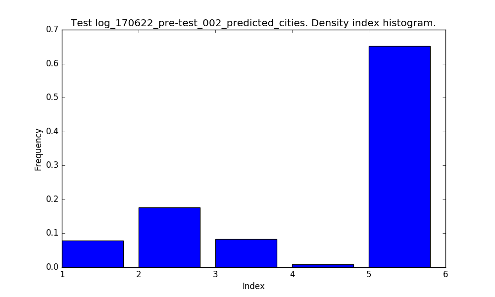
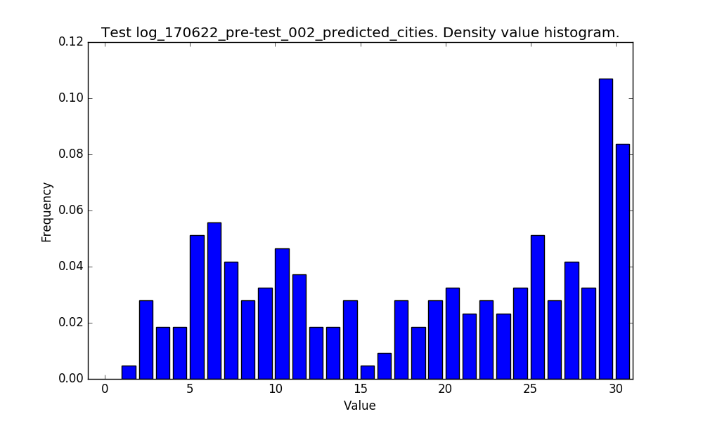
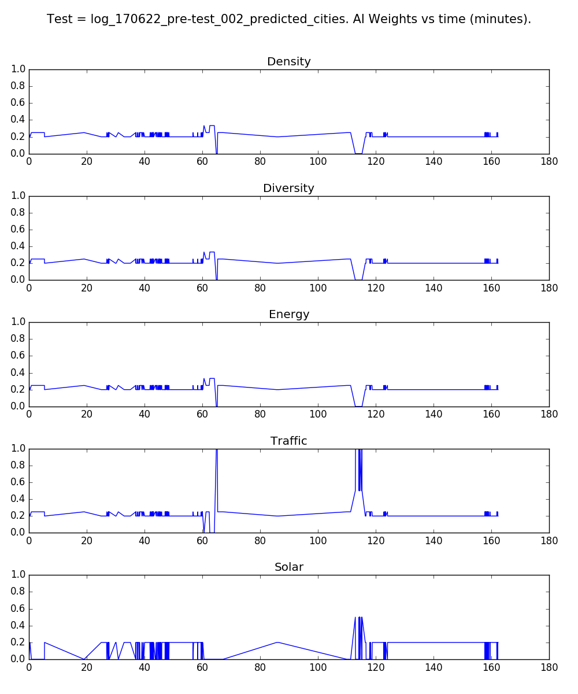
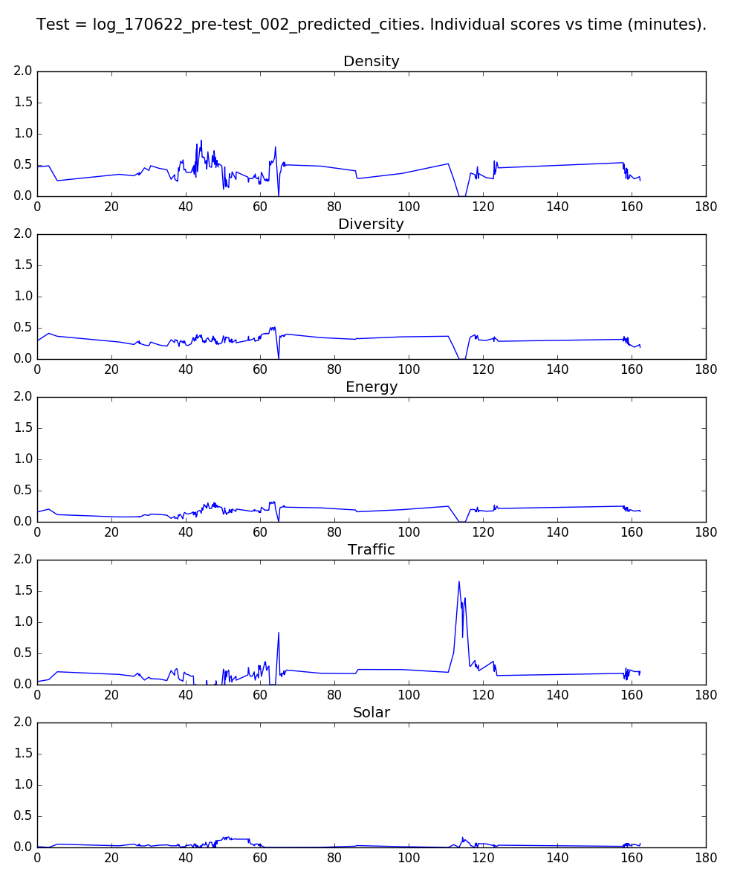
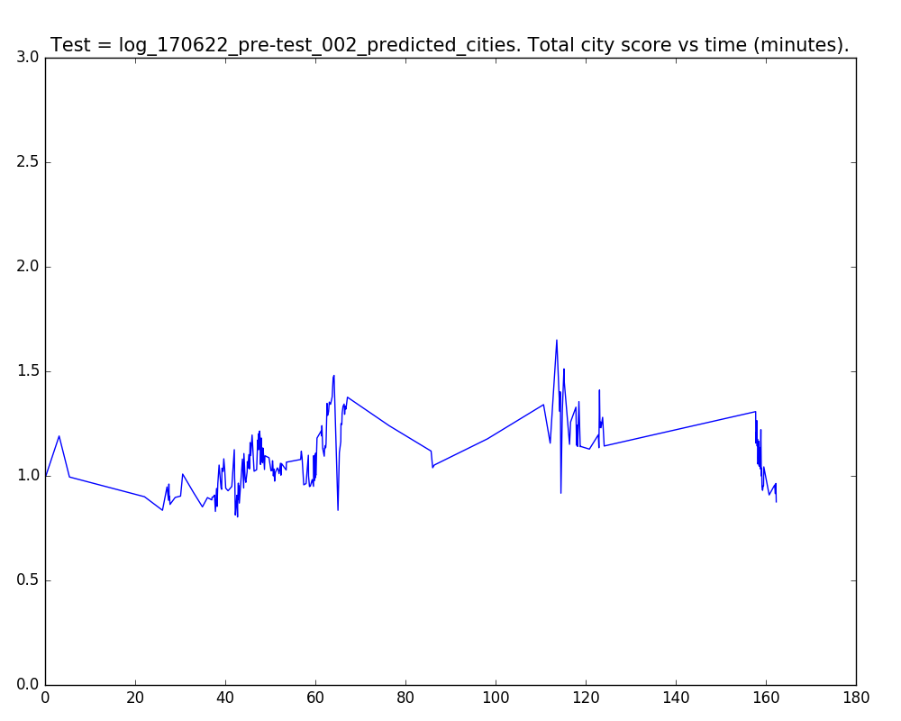

# CityMatrixSim Data Analysis - User Test 002

Here, we seek to analyze some key data metrics from our CityMAItrix Assistant. Use the quick links below to get from section to section.

1. [AI Move Type Choice](#ai-move-type-choice)
- [Density Move Index](#density-move-index)
- [Density Move Values](#density-move-values)
- [AI Weights](#ai-weights)
- [Individual City Scores](#individual-city-scores)
- [Total City Scores](#total-city-scores)

## AI Move Type Choice

Here are the exact move type counts and corresponding percentages.

- Total Cities = 462
- CELL = 247 = 53.4 %
- DENSITY = 215 = 46.6 %

## Density Move Index

For **DENSITY** changes, this is the distribution of the density array index where it acts.

## Density Move Values

And here are the values that the AI tends to suggest.

## AI Weights

We can take a look at the user's AI weighting values over time.

## Individual City Scores

Now, we can take a look at each score value over time. Here, I average over every *N = 2* data points to smooth out our score data.

## Total City Scores

Now, let's take a look at the **total score value for the city** over time. Again, I average over every *N = 2* data points to smooth out our score data.

