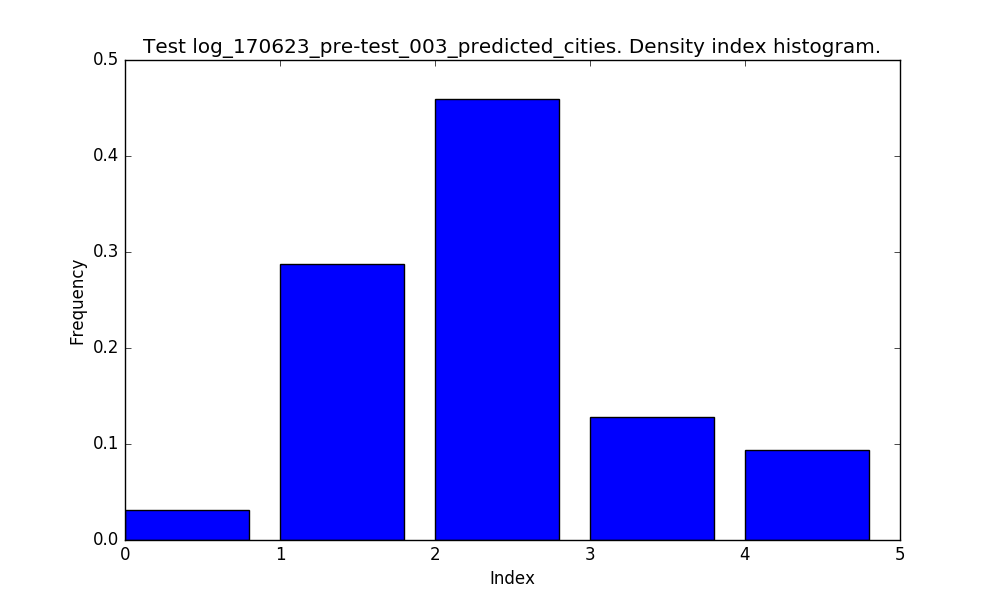
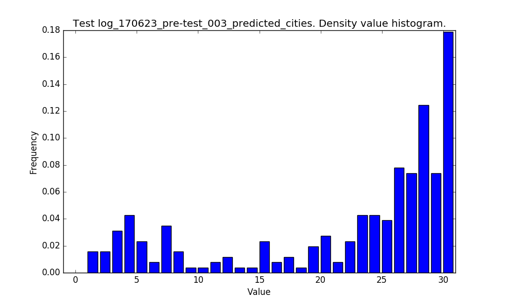
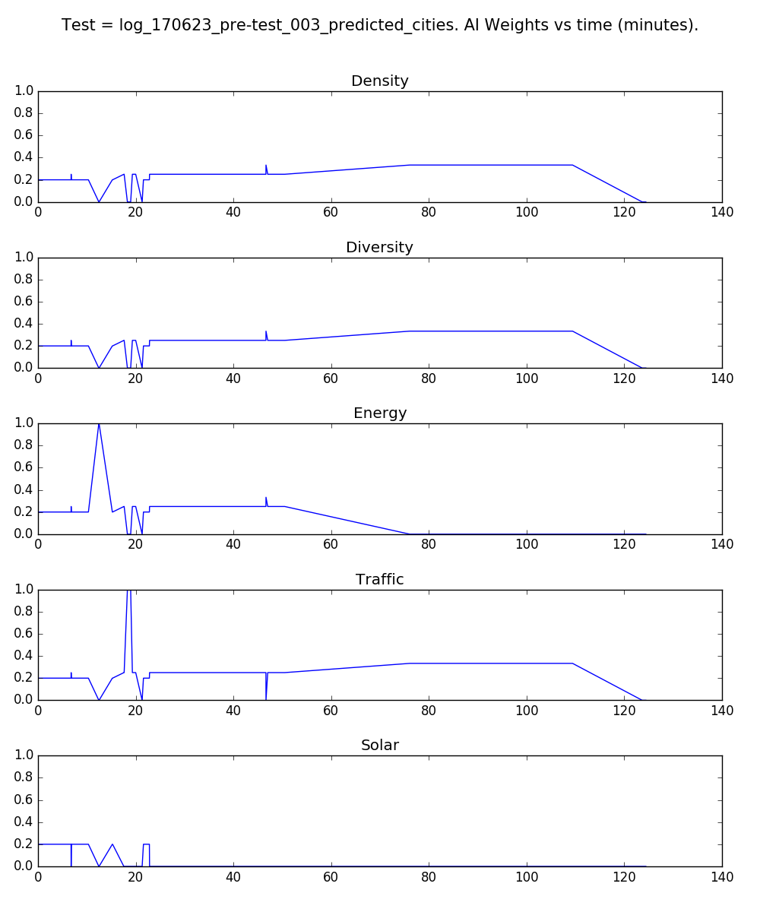
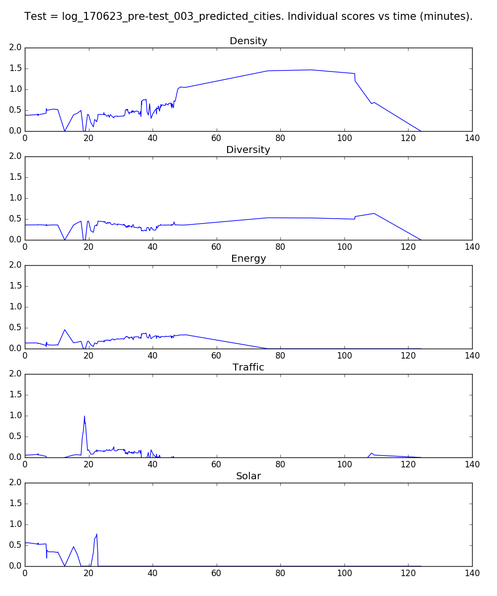
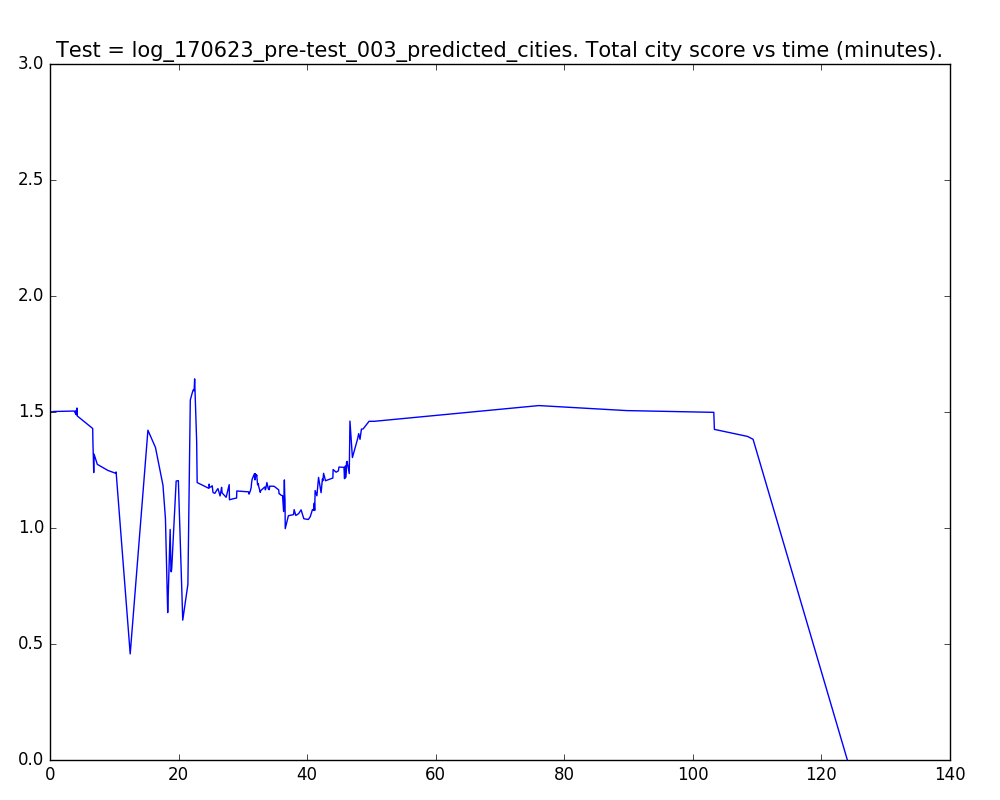

# CityMatrixSim Data Analysis - User Test 003

Here, we seek to analyze some key data metrics from our CityMAItrix Assistant. Use the quick links below to get from section to section.

#### Quick Links

1. [AI Move Type Choice](#ai-move-type-choice)
2. [Density Move Index](#density-move-index)
3. [Density Move Values](#density-move-values)
4. [AI Weights](#ai-weights)
5. [Individual City Scores](#individual-city-scores)
6. [Total City Scores](#total-city-scores)

## AI Move Type Choice

Here are the exact move type counts and corresponding percentages. [(back to top)](#quick-links)

- Total Cities = 317
- CELL = 60 = 19.0 %
- DENSITY = 257 = 81.0 %

## Density Move Index

For **DENSITY** changes, this is the distribution of the density array index where it acts. [(back to top)](#quick-links)

## Density Move Values

And here are the values that the AI tends to suggest. [(back to top)](#quick-links)

## AI Weights

We can take a look at the user's AI weighting values over time. [(back to top)](#quick-links)

## Individual City Scores

Now, we can take a look at each score value over time. Here, I average over every *N = 2* data points to smooth out our score data. [(back to top)](#quick-links)

## Total City Scores

Now, let's take a look at the **total score value for the city** over time. Again, I average over every *N = 2* data points to smooth out our score data. [(back to top)](#quick-links)

