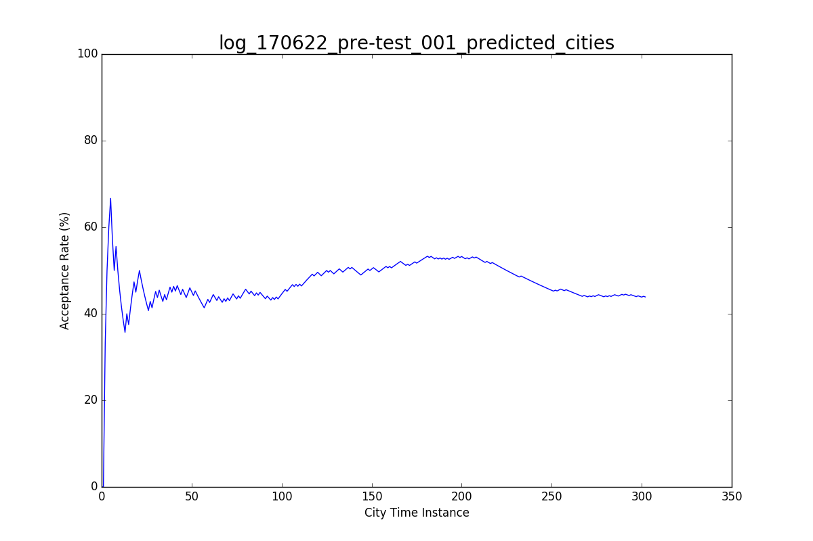

# CityMatrixSim Data Analysis

## 1. AI Move Choice

Here are the types of moves the AI is suggesting.

- **DENSITY CHANGE**: 52.03 %
- **CELL CHANGE**: 47.97 %

For **DENSITY** changes, this is the distribution of the density array index where it acts.


And here are the values that the AI tends to suggest.


Now, let's look at **CELL** changes. Here is a heat map of where the AI tends to make changes.


And here are the cell types that the AI tends to suggest.


## 2. AI Weights

First, let's examine the `city.AIWeights` parameter in three user tests cases.

*Note*: The plot order is based on the following array:

```
metric_names = [ "Density" , "Diversity" , "Energy" , "Traffic" , "Solar" ]
```

**log\_170622\_pre-test\_001\_predicted\_cities**


**log\_170622\_pre-test\_002\_predicted\_cities**


**log\_170622\_pre-test\_003\_predicted\_cities**


## 3. AI Total Scores

Now, let's take a look at the **total score value for the city** over time.


## 4. AI Individual Scores

Now, we can take a look at each score value over time. This is equivalent to the metric * weight for that particular score element.


## 5. AI Acceptance

Finally, we want to look at the **AI suggestion acceptance ratio** through the time of our tests. That is, we would like to understand how often the user **accepts** the move suggested by the AI on a previous step.

We define the acceptance rate *R* as the number of times the user follows the previous `city.AIMov` parameter over the total number of cities. We can track this metric throughout the progress of the test to examine user behavior.




## 6. More to come...

Stay tuned for more analysis!!!