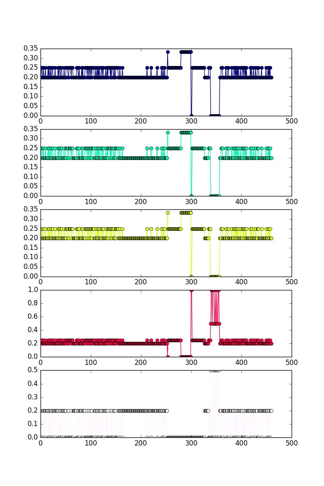

# CityMatrixSim Data Analysis

## 1. AI Move Choice

*Note: We are using data from [this archive on Dropbox](https://www.dropbox.com/home/CityMatrixSim_Data/citymatrix%20user%20test%20log/Server%20Data/Archive?preview=CityMatrix_log_170622_pre-test_001-002.zip) for this section.*

Here are the types of moves the AI is suggesting.

- **DENSITY CHANGE**: 52.03 %
- **CELL CHANGE**: 47.97 %

For **DENSITY** changes, this is the distribution of the density array index where it acts.


And here are the values that the AI tends to suggest.


Now, let's look at **CELL** changes. Here is a heat map of where the AI tends to make changes.


And here are the cell types that the AI tends to suggest.


## 2. AI Scores/Weights

First, let's examine the `city.AIWeights` parameter in three user tests cases.

*Note*: The plot order is based on the following array:

```
metric_names = [ "Density" , "Diversity" , "Energy" , "Traffic" , "Solar" ]
```

**log\_170622\_pre-test\_001\_predicted\_cities**


**log\_170622\_pre-test\_002\_predicted\_cities**



**log\_170622\_pre-test\_003\_predicted\_cities**


Now, let's take a look at the **total score value for the city** over time.


Now, we can take a look at each score value over time. This is equivalent to the metric * weight for that particular score element. Again, the plot order is based on the ```metric_names``` array from above.