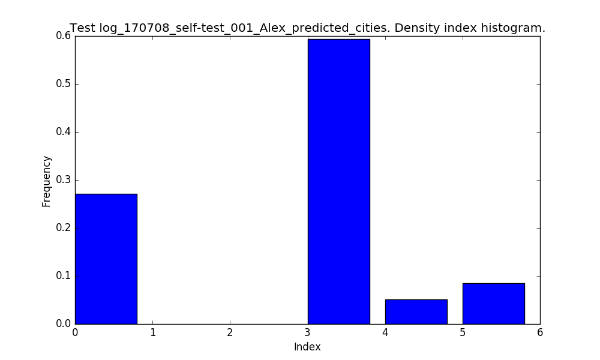
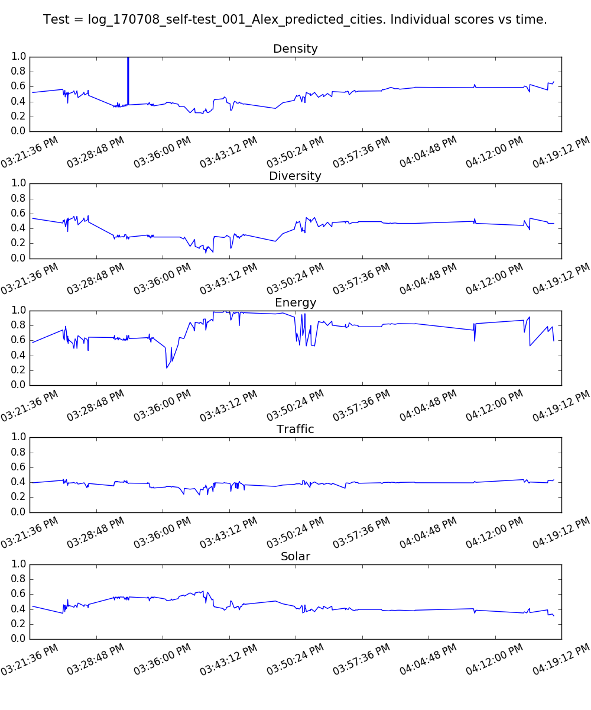
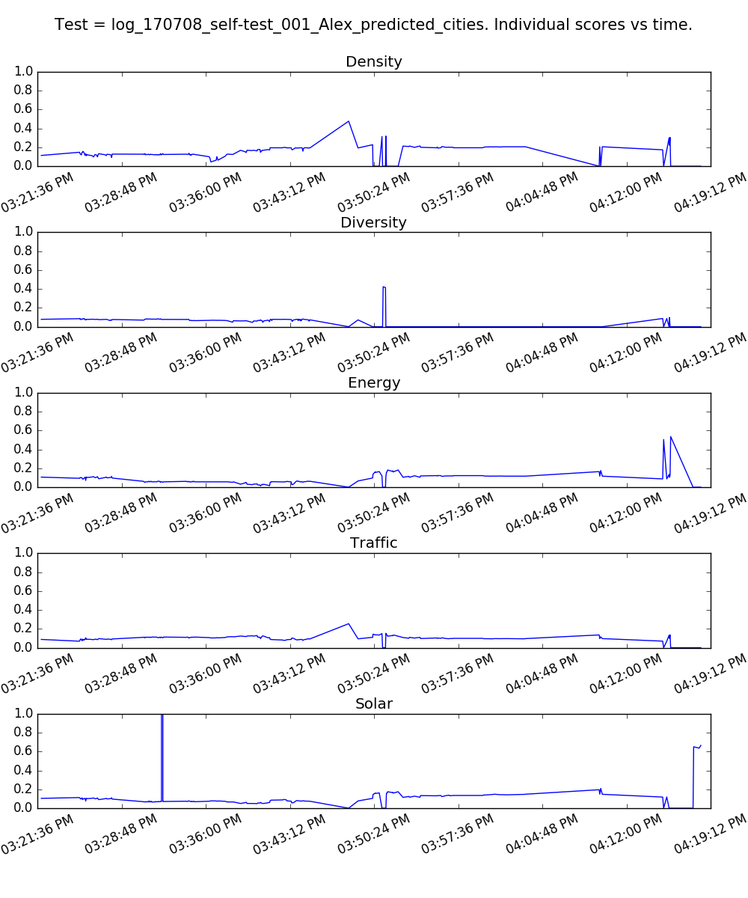

# CityMatrixSim Data Analysis - Alex/Ryan User Test 07/08/2017 *(Latest)*

Here, we seek to analyze some key data metrics from our CityMAItrix Assistant. Use the quick links below to get from section to section.

#### Quick Links

1. [Configurations](#configurations)
2. [AI Move Type Choice](#ai-move-type-choice)
3. [Density Move Index](#density-move-index)
4. [Density Move Values](#density-move-values)
5. [AI Weights](#ai-weights)
6. [Individual City Scores](#individual-city-scores)
7. [Total City Scores](#total-city-scores)
8. [AI Acceptance Rate](#ai-acceptance-rate)
9. [Density ID Distribution](#density-id-distribution)

## Configurations

Here is some key information about this round of data analysis for clarity purposes.

1. The data starts at epoch time `1499541716`, which corresponds to **Saturday, July 8, 2017 3:21:56 PM**.
2. We now include the `ai` or `predict` key from the JSON data, whichever is available. (I look for `ai` first, then `predict` if needed.)
3. For AI Acceptance, we only consider cases where `city.AIStep` is `20` **AND** we have access to the `ai` city key in the JSON. You will notice that change toward the end of this document. Note: This is only **defined** for times > Saturday, July 8, 2017 3:48:14 PM, or > epoch `1499543294`. It is 0 until that point.
4. I removed the `N = 2` graph score smoothing here - no longer needed.

## AI Move Type Choice

Here are the exact move type counts and corresponding percentages. [(back to top)](#quick-links)

- Total Cities = 227
- CELL = 168 = 74 % 
- DENSITY = 59 = 26 %

## Density Move Index

For **DENSITY** changes, this is the distribution of the density array index where it acts. [(back to top)](#quick-links)

## Density Move Values

And here are the values that the AI tends to suggest. [(back to top)](#quick-links)

## AI Weights

We can take a look at the user's AI weighting values over time. [(back to top)](#quick-links)

## Individual City Scores

Now, we can take a look at each score value over time. No smoothing here. [(back to top)](#quick-links)

**No weights, just** `metric` **value from** `city.metrics` `dict` **.**

**Now, including weights.**

## Total City Scores

Now, let's take a look at the **total score value for the city** over time. [(back to top)](#quick-links)

## AI Acceptance Rate

Here, we look at the **AI acceptance rate**. We consider the AI move to be **accepted** if the user makes that same move in the next 3 steps. [(back to top)](#quick-links)

For a `'DENSITY'` type move, we only look at the index in the density array, not the actual value. This deals with small errors on the toggle.

We use a `MOVE_THRESHOLD` to deal with the cities that are sent in between moves by the GH client.

We bucket the rates into `BIN_SIZE = 5` groups to look at the rates over time.

So, we define the acceptance rate *R* over a time range *[a, b]*, where *b - a* = `BIN_SIZE`, to be

  

where *M[i]* = 1 if the user accepts the AI at time *i*, else 0.

**`MOVE_THRESHOLD = 3`**

**`MOVE_THRESHOLD = 5`**

## Density ID Distribution

Here is the block count of each cell ID type over time.

